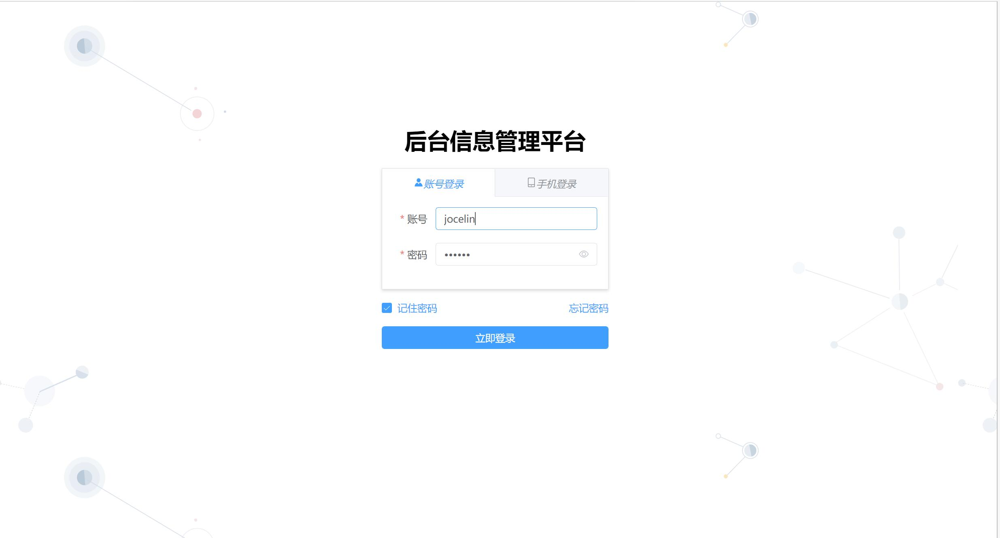
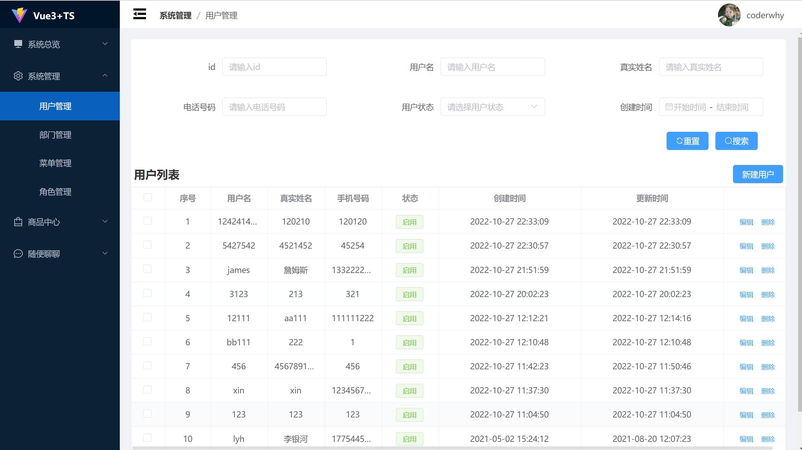
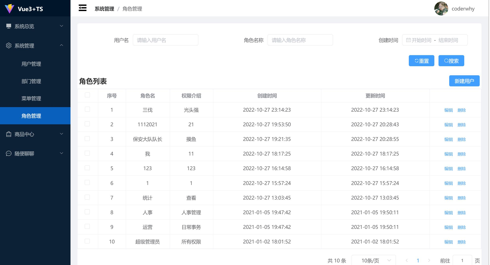
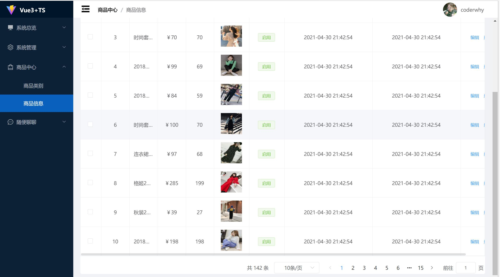
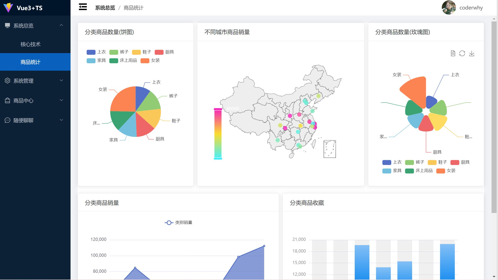

# 一、项目描述
### 本项目是基于 Vue3 全家桶、Element-plus、Echarts、TypeScript 等技术栈，运用组件化思想开发的一个可复用的后台信息管理平台，开发过程采用 eslint、git husky 规范代码和提交。项目主要功能模块包括：用户登录、用户管理、部门管理、菜单管理、权限管理、数据统计、问题反馈，支持数据新增、修改、删除、模糊查找
# 二、项目展示
### 用户登录页面(图片有可能因为网络原因加载不出)

### 用户管理页面

### 角色管理页面

### 商品管理页面

### 数据统计页面

